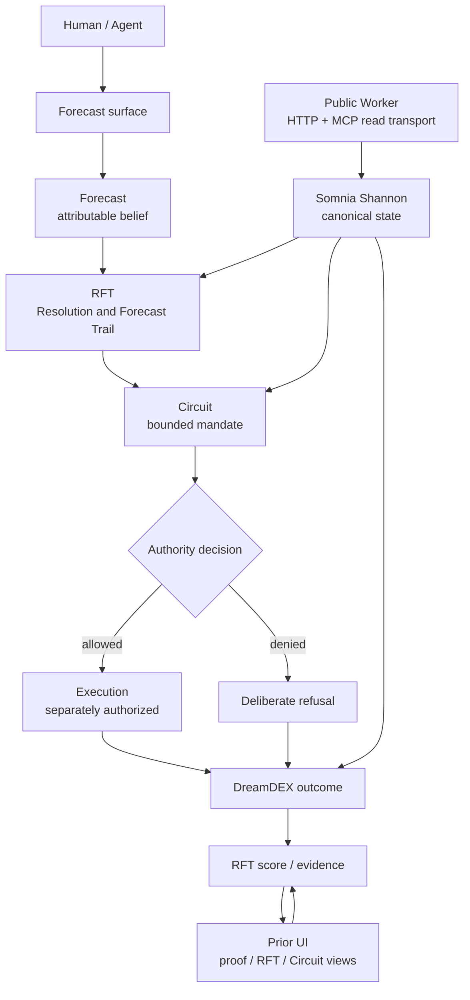

# PRIOR Submission Architecture



## Core distinction

```text
belief ≠ evidence ≠ authority ≠ execution
execution ≠ outcome ≠ reputation
```

The Worker, HTTP API, MCP transport, and UI are observation/integration surfaces. They do not become authority. Shannon contracts and DreamDEX state remain canonical for the live proof.

## Current hosted boundary

- live Shannon detail reads: enabled;
- bounded market/Circuit discovery: enabled;
- HTTP and MCP reads: enabled;
- Forecast submission: disabled;
- signer custody: absent;
- economic execution: disabled;
- durable multi-agent state: absent.
